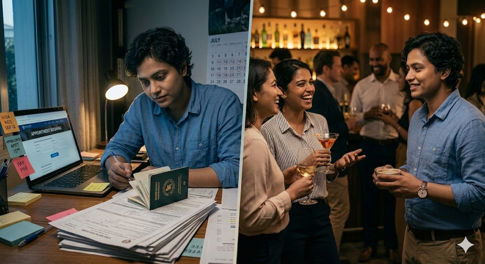

::: justify-text

**Hello everyone!**\
Welcome to my blog 🎉\
Today, I will share something from personal experience. As an international researcher, I live in two worlds simultaneously — one is the world of science, full of curiosity, collaboration, and ideas that feel genuinely borderless. The other is the world of paperwork, embassies, appointment slots, and waiting. I have sat in front of a conference registration page, acceptance letter in hand, and felt not excitement but dread — because I knew what came next. Not packing, not preparing slides, not preparing my poster, but calculating whether the embassy appointment would come through in time, and whether the odds were in my favour this year. This blog post is about that second world, and why it matters more than most people in science are willing to admit.

There is a beautiful myth at the heart of modern science: that knowledge is universal, that curiosity knows no nationality, and that the pursuit of truth binds researchers across every border, language, and background. It is a myth worth believing in. And yet, for a significant portion of the world's researchers — those who come from countries outside the traditional centres of Western academia — the daily reality of a scientific career is a quiet, persistent negotiation with barriers that their colleagues from wealthier nations rarely have to think about.

This is not a complaint. It is an observation. And perhaps, in making it visible, we can begin to ask better questions about what truly equal participation in global science might look like.

<figure style="width: 70%; max-width: 680px; margin: 2em auto; display: block; text-align: center;">
  
  <figcaption style="font-size: 0.85em; text-align: center; margin-top: 0.5em; color: #555;">
    Image created using Google Gemini
  </figcaption>
</figure>

**The Visa: A Letter of Permission to Do Science**\
Ask any international researcher from South Asia, Africa, Latin America, or parts of Southeast Asia about conference travel, and you will almost always hear a visa story. Not a travel story — a *visa* story.

The abstract gets accepted. The excitement is real. You book the flight, register for the conference, and book the hotel. Then begins the bureaucratic marathon: bank statements, supporting letters from your institution, letters from the conference organisers, proof of ties to your home country, proof of employment, proof of funding. You pay a non-refundable fee for the privilege of being assessed.

And then you wait.

In the best cases, the visa arrives in time. In others, it arrives the day before the conference — or the day after. In the worst cases, it does not arrive at all. No explanation. No recourse. Just a rejection stamp and the quiet humiliation of emailing your session chair to say you will not be coming.

The financial loss alone is staggering for early-career researchers: flights that cannot be cancelled, accommodation that was booked months in advance. But the less quantifiable cost — of a missed keynote, a missed session, a missed chance to present your work to the people whose opinions matter most in your field — is perhaps even greater.

There is a particular cruelty in the timing. Most major conferences — EASL, AASLD, ISTH, ESHG, and dozens of others — cluster in the summer months, between June and September. This is also peak holiday season across Europe and North America. The consequence is rarely discussed: embassy appointment slots for visa applications become intensely contested during precisely this window, not only by researchers but by the far larger wave of tourists, students, and families planning summer travel. A researcher from Colombo or Lagos competing for an appointment at a British or American consulate in June is not just navigating a visa process — they are navigating a seasonal bottleneck that was never designed with them in mind. Processing times stretch, appointment availability collapses, and the margin for error narrows to almost nothing. The two systems — conference calendars and consular capacity — have never been designed to work together, and the researcher caught between them has very little power to change either.

**The Remote Presenter Problem**\
For those whose visas do not arrive in time, or who cannot afford the risk of applying, there is increasingly an alternative: virtual participation. Present your paper over a video call while your colleagues sit in the room.

It is better than nothing. But it is not the same.

Science is not just about presenting data. It is about being in the room when a question is asked and a conversation begins. It is about catching someone in the hallway after your talk and hearing them say, *I have been working on something related — we should talk.* It is about the spontaneous, unstructured moments that no Zoom call has ever fully replicated.

The remote presenter is present in name and absent in every other way that matters for the long arc of a career. And increasingly, as virtual fatigue sets in and hybrid conferences become the norm, remote presenters are an afterthought — a small box in the corner of a screen that the room collectively forgets is there.

**The Networking Gap**\
When people think about academic networking, they think of conference sessions, poster halls, and panel discussions. These are important. But a great deal of the real relationship-building in academia happens in the informal margins — the coffee breaks, the dinners, the spontaneous conversations that spill out of a session room and continue for an hour in a corridor.

International researchers are often at a structural disadvantage in these spaces — not because they are less social or less capable of forming connections, but because the informal architecture of academic life was built around a set of assumptions that do not always travel well across geography and background.

Researchers who have attended conferences in the same circuits for years arrive knowing people already. They have shared histories, shared references, shared memories of previous meetings. For someone attending their first — or perhaps only — international conference in years, breaking into those existing social clusters can feel like arriving late to a party where everyone already knows each other.

This is compounded by something subtler: the storytelling currency of informal academic socialising. Travel stories, transit mishaps, the shared comedy of conference logistics — these are reliable icebreakers among people who travel frequently. For someone who has spent years navigating the visa process just to be in the room, whose relationship to international travel is fraught rather than casual, engaging in that same register of easy cosmopolitan banter can feel like performing a role rather than being yourself.

None of this is anyone's fault. But the cumulative effect is real: collaboration networks in many fields correlate strongly with geography, institutional prestige, and frequency of conference attendance — all of which disadvantage researchers from the Global South in ways that have nothing to do with the quality of their science.

**The Compounding Disadvantage**\
The visa problem and the networking problem do not exist in isolation. They compound.

Fewer conferences attended means fewer connections made. Fewer connections means fewer collaborative projects, fewer co-authored papers, fewer citations. Fewer citations means weaker grant applications. Weaker grant applications means less funding for travel. Less funding for travel means fewer conferences attended.

It is a loop, and it is very difficult to break out of once you are inside it.

A researcher based in Western Europe or North America may attend five or six international conferences a year, building their network steadily across a decade. A researcher of equivalent ability from South Asia or sub-Saharan Africa may manage one — if the visa comes through. The divergence in career outcomes over time is not a mystery. It is arithmetic.

What makes this particularly difficult to talk about is that it is not the result of overt discrimination. No one is being explicitly excluded. The systems that produce these outcomes were simply never designed with the full diversity of global science in mind.

**The Emotional Toll**\
A paper rejection stings, but you understand the process. You revise, you resubmit, you move on. A visa rejection carries a different kind of weight. It is issued by a state, not a peer. It comes with no feedback, no path to revision, no clear explanation. It tells you, in the bluntest administrative language, that you are not trusted to travel, to attend, to participate — simply by virtue of where you were born.

For early-career researchers especially, who are still building their sense of identity and legitimacy within their field, this can be deeply discouraging. And it happens quietly, invisibly, in ways that never show up in any conference programme or institutional report.

**What Could Be Different**\
None of this is inevitable. There are practical, achievable changes that conferences, institutions, and funding bodies could make.

Conference organisers often do have visa support systems in place, but these need to be strengthened and treated as a core element of conference planning rather than an afterthought, with the same seriousness as accessibility accommodations. They could also genuinely reimagine what virtual participation looks like, investing in infrastructure that enables remote presenters to feel like active participants rather than passive spectators.

Funding bodies could acknowledge travel inequality explicitly in grant structures, recognising that a researcher based in Nairobi or Colombo faces different costs — financial and bureaucratic — than one based in Amsterdam or Boston. Travel grants for international conference attendance, targeted at researchers from countries with high visa rejection rates, could make a tangible difference.

And all of us who attend conferences regularly, who have the privilege of easy travel, can do something small but meaningful: make the effort to seek out the researchers who are new to the room, who are attending for the first time or the first time in years, and include them in the conversations that matter.

**A Final Thought**\
Science is, at its best, one of humanity's most genuinely collaborative endeavours. It is built on the premise that a good idea can come from anywhere, and that knowledge grows when it is shared freely across the widest possible range of minds.

We have not yet built the infrastructure to match that premise. The researchers who are most likely to bring fresh perspectives — who work in under-studied contexts, who ask questions that the mainstream hasn't thought to ask — are often the ones least able to show up to the room where the conversations happen.

That is a loss for all of us. Not just for them.

---

*If you are an international researcher with your own experience of these barriers, I would love to hear from you. These stories deserve to be told — and heard.*

:::

<!-- Giscus Comment Box -->

  

