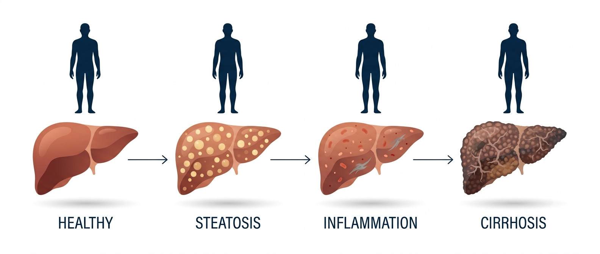

::: justify-text
*The hardest-working organ in your body is also the quietest, and across South Asia that silence is becoming a public health crisis hiding in plain sight.*\

Think of the last big family gathering you went to. A wedding, an anniversary, a long Sunday lunch that stretched into the evening. Somewhere between the food and the tea, the conversation turned, as it always does, to health. Someone's blood pressure was "running high." An uncle had started walking every morning for his heart. A cousin had been told to watch her sugar. A grandparent's cholesterol was a running theme across three generations.\

Now ask yourself: in all of that careful, loving worry, did anyone once mention their liver?\

Almost certainly not. In most South Asian families, the liver is the organ nobody talks about. We track our blood pressure, we fear diabetes, we respect the heart. But the liver sits quietly in the background, unmentioned and unmonitored, until the day it can no longer be ignored, and by then the conversation is very different. This blog is the beginning of a series about changing that, and it starts with a simple question: what is this organ actually doing while we ignore it?\

**What your liver actually does**\

Your liver is the largest solid organ inside your body, a dense, reddish-brown mass tucked up under your right ribs, weighing somewhere between one and one and a half kilograms. It is also, without exaggeration, one of the busiest chemical factories in nature. Scientists have counted more than 500 distinct functions that the liver performs. You could not survive more than a day or two without it. Let me give you just four, each with a picture to hold on to.\

First, the liver is your body's **metabolic clearinghouse**. Every mouthful of food you eat (the rice, the roti, the dal, the sweets) is broken down into sugars, fats, and proteins, and almost all of it is routed through the liver first. The liver decides, moment to moment, what to burn for energy, what to store for later, and what to send back into the blood. Think of it as the central bank of your body, constantly setting the exchange rate between what you eat and what your cells can use.\

Second, the liver is your **detoxification plant**. Alcohol, medicines, the natural waste products of your own metabolism, environmental toxins: the liver takes these apart and repackages them so your body can safely get rid of them. It does much of this work using a remarkable family of enzymes called cytochrome P450, molecular scissors that can dismantle compounds the body has never even encountered before. Every paracetamol tablet you have ever swallowed was processed here.\

Third, the liver is a **manufacturing unit**. It produces bile, a greenish fluid stored in the gallbladder and released into your gut to break down the fats in your food. Without it, that plate of biryani would pass through you largely undigested. And fourth, the liver is a **safety factory**: it makes most of the proteins that allow your blood to clot. When you cut yourself and the bleeding stops, you have your liver to thank. A body without a working liver is a body that cannot properly feed itself, clean itself, digest, or heal.\

**The most forgiving organ in your body**\

Here is the part that genuinely astonishes people. Of all the organs in the human body, the liver is almost unique in its ability to regenerate. If a surgeon removes a large portion of a healthy liver (as happens in living-donor transplants, where one person gives part of their liver to another), the remaining tissue can grow back to nearly its full size within weeks. Both the donor's liver and the recipient's new partial liver regrow. No other major internal organ can do anything close to this.\

This capacity for renewal is ancient enough to appear in myth. In the Greek story of Prometheus, punished by the gods, an eagle devours his liver each day only for it to grow back each night, an eternal cycle of damage and repair. The storytellers who imagined that punishment thousands of years ago had, remarkably, grasped something true about human biology.\

But here is the twist, and it is the single most important idea in this entire series. The very quality that makes the liver so resilient, its ability to keep repairing, adapting, and carrying on, is also exactly why serious liver disease can hide for so long. A liver under strain does not complain. It simply patches itself up and keeps working, year after year, long after the damage has begun. Its strength is also its disguise.\

**Why the liver suffers in silence**\

Most of the organs that frighten us announce themselves. A struggling heart gives you chest pain and breathlessness. Failing kidneys change how you pass water. The lungs make you cough. The liver, by contrast, has almost no nerve endings that register pain from within its own tissue. It cannot send you an early warning, because it has no alarm to ring.\

So the disease progresses quietly. Fat begins to build up inside the liver cells. Over years, in some people, that fat triggers inflammation, and inflammation slowly lays down scar tissue, a process called fibrosis. The liver keeps compensating, keeps performing its hundreds of jobs, keeps you feeling entirely normal, until so much of it has been replaced by scar that it can no longer keep up. Only at that late stage do the visible signs appear: the yellowing of the eyes and skin we call jaundice, swelling in the abdomen and legs, confusion, easy bruising. By the time a person notices something is wrong, the disease is often advanced and much harder to treat. The absence of a symptom is mistaken for the absence of a problem.\

This is not a rare tragedy. Across South Asia, patients routinely arrive at hospitals with liver disease that has already reached cirrhosis (extensive, often irreversible scarring), never having had a single symptom that sent them to a doctor sooner. The silence is not the exception. It is the rule.\

<figure style="width: 90%; max-width: 900px; margin: 2em auto; display: block; text-align: center;">
  
  <figcaption style="font-size: 0.85em; text-align: center; margin-top: 0.6em; color: #888; font-family: 'Source Sans 3', sans-serif;">
    Fatty liver can advance quietly from a healthy liver, through fat build-up and inflammation, to scarring and cirrhosis, often with no symptoms at all until the late stages. 
    <em>Image created using Google Gemini</em>
  </figcaption>
</figure>\

**Why South Asia needs to pay attention now**\

For a long time, serious liver disease in our part of the world was thought of mainly in terms of infections like hepatitis, or the effects of alcohol. Those remain important. But a newer, quieter epidemic has been rising fast, and it is tied to the way we now live and eat.\

The medical name for it is metabolic dysfunction-associated steatotic liver disease, or MASLD (you will meet that term properly in the next post, so do not worry about memorising it yet). In plain language, it is the build-up of fat in the liver linked to our metabolism: to how our bodies handle sugar, insulin, and stored energy. And South Asia is, by several measures, standing directly in its path.\

Our cities have transformed within a single generation. Refined flour, sugar-sweetened drinks, ultra-processed snacks, and long hours of sitting have replaced the more active, less processed lives of our grandparents. But there is something more, something specific to us. South Asian bodies tend to carry fat differently, often deep inside the abdomen, wrapped around the organs, where it does the most metabolic harm, rather than in a way you can easily see in the mirror. It is entirely possible to be slim by every outward measure and still be carrying a liver under strain. Doctors have a name for this pattern, and an entire chapter of this series will be devoted to it. Add to this that liver disease is appearing in South Asians at younger ages than in many Western populations, and you have the makings of a crisis that is already here: we are simply not looking for it. The tragedy of a silent disease in a population that has never been taught to watch for it is that the damage is well underway before anyone thinks to check.\

**What this series will cover**\

That is why I am writing this. I am a researcher who spends my days studying this disease (the immune cells and the metabolism behind it), and I have come to believe that the science we discuss so freely in labs and journals rarely reaches the families who most need it. Over the coming posts, I want to close that gap, one clear idea at a time.\

We will look at why the disease recently changed its name, and why that matters. We will ask how common it truly is across South Asia. We will follow the journey from a simple fatty liver to something dangerous, and we will spend real time on the surprising, under-recognised reality of fatty liver in slim people. We will talk about how it is diagnosed, why it is so often missed here, and, importantly, what the evidence actually says you can do about it. I will keep the language plain, I will lean only on solid science, and where the evidence is thin or uncertain, I will tell you so honestly rather than overpromise.\

The liver has spent your whole life working for you without asking for anything in return. The least we can do is learn to hear it before it is forced to shout. In the next post, we will start with the name itself, because the way we talk about this disease has been quietly getting in the way of understanding it.\

:::

<!-- Giscus Comment Box -->

  

