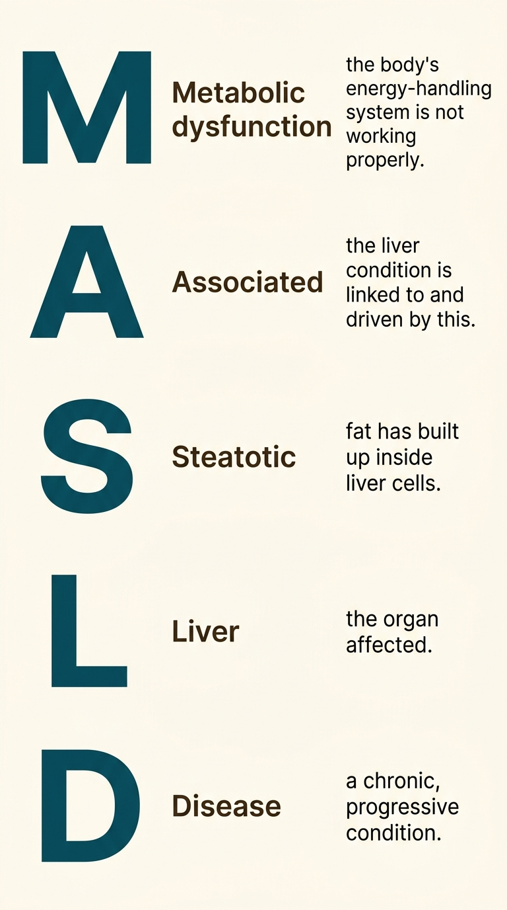

**Hello everyone!**\
Welcome to my blog 🎉\
Today, I want to continue from where we left off last time, because before we can properly talk about fatty liver disease, we need to talk about something more fundamental: what we call it, and why the name we use has spent decades quietly getting in the way.

*The way we name a disease shapes how patients feel, how doctors think, and how whole communities decide whether to come forward or stay silent.*

Picture this scene. A middle-aged man, slim, a lifelong teetotaller, goes for a routine ultrasound. The report comes back with an unexpected finding: fatty liver. His doctor, following the old textbook, tells him this is a condition caused by drinking too much alcohol. The patient is confused, then offended. He has never touched alcohol in his life. He wonders if there has been a mistake. He does not come back for follow-up. His wife does not believe him. The condition that needed attention quietly continues, unmonitored and unnamed.

This story is not unusual. For decades, the medical world was using a name for fatty liver disease that was, in ways we are only now reckoning with, misleading patients and putting them off from engaging with their own healthcare. In 2023, that name was officially changed. Understanding why this happened, and what the new name means, is the foundation for everything else in this series.

**🗓️ Where the old name came from**

The story begins in 1980, in a paper published in the journal *Mayo Clinic Proceedings*, in which a physician named Jurgen Ludwig described a pattern he had been noticing in patients: people who had never drunk alcohol in significant quantities, yet whose livers, when biopsied, looked exactly like the livers of people who had. The injury, the fat, the inflammation, the scarring: all of it matched what had historically been called alcoholic liver disease.

Ludwig needed a term that captured this resemblance while distinguishing these patients from those whose liver damage was caused by drinking. He called it **nonalcoholic fatty liver disease**, or NAFLD. For its time, it was a reasonable solution to a naming problem. The word "nonalcoholic" told doctors: this patient has a liver that looks like an alcoholic's, but they are not one. It was a clinical shorthand.

That shorthand survived for over four decades. NAFLD became the universally accepted term in textbooks, research papers, clinical guidelines, and patient leaflets. The more severe form, involving inflammation, was called NASH, which stood for nonalcoholic steatohepatitis. These acronyms defined the field.

But as the number of people affected by the disease grew, and as researchers began to understand its true causes more deeply, the problems with the old name became harder to ignore.

**⚠️ Why "nonalcoholic" was the wrong word**

There are two major problems with defining a disease by what it is not.

The first is confusion. If your doctor tells you that you have a *nonalcoholic* liver condition, the first thing most patients hear is alcohol. The word sits in the sentence like an accusation, even with "non" attached to it. In South Asian communities, where alcohol is either prohibited by religion or strongly stigmatised socially, the implication is particularly harmful. Patients who have never drunk a single unit of alcohol find themselves in the impossible position of explaining this to their families, while the conversation that should be happening, about their metabolism, their diet, their insulin levels, their risk of progression, never takes place. Shame and confusion crowd out medicine.

The second problem is misdirection. Naming the disease by what does not cause it tells you nothing useful about what does. "Nonalcoholic" points the gaze in the wrong direction entirely: away from the metabolic dysfunction that actually drives the disease. A doctor seeing a patient labelled with NAFLD might focus their questions on drinking habits. They might not think to ask about insulin resistance, or abdominal fat, or family history of diabetes. The name was quietly steering clinical attention away from what mattered.

In 2020, a survey asked a large group of patients and specialists how they felt about the terminology. The results were striking. More than sixty percent of respondents felt that the term "nonalcoholic" was stigmatising. Nearly two thirds felt the same about the word "fatty." These were not minor objections from a small minority. They were majority views, from the very people who lived and worked with this disease every day.

**🌍 The global effort to find a better name**

What followed was a remarkable piece of international collaboration. In 2022 and 2023, a group of more than three hundred specialists from around the world, including hepatologists, endocrinologists, patient advocates, and researchers, came together in what is known as a Delphi consensus process. In this kind of exercise, experts from different countries and disciplines independently assess a set of proposals and vote on them, going through several rounds until clear agreement emerges.

The goal was to replace NAFLD with a name that accurately reflected the disease's true nature, reduced stigma, and was usable across languages and cultures. After extensive debate and multiple rounds of voting, they arrived at a new name that was adopted by all major liver disease societies worldwide.

That name is **MASLD**: Metabolic Dysfunction-Associated Steatotic Liver Disease.

**🔬 What the new name actually means**

Let us take the new name apart, because each word is doing real work.

**Metabolic dysfunction** is the engine of the disease. The liver does not accumulate fat in isolation. It does so because the body's metabolic system, the complex machinery that handles energy, sugar, and fat, is not working as it should. Insulin resistance (a condition we will explore in depth in a later post) plays a central role here. So does the way the body distributes fat, particularly in South Asians. The new name announces this from the outset: the liver is injured because the metabolism is struggling. That is where the clinical attention should go.

{width=35% fig-align="center"}

*A breakdown of what each word in MASLD stands for. Image created using Google Gemini.*

**Associated** simply links the two halves of the name. The steatotic liver disease is associated with, caused by, and intertwined with the metabolic dysfunction.

**Steatotic** is the technical word for fat-laden. It comes from the Greek *stear*, meaning fat. Steatosis is the process by which fat accumulates in liver cells. Using "steatotic" instead of "fatty" removes the everyday judgement that "fatty" carries; no one thinks of "steatotic" as a slur, while it is also more biologically precise. Fat in the liver is a specific, measurable finding, and the word now names it without editorialising.

**Liver disease** is exactly what it says.

The more severe, inflammatory form of the disease, previously called NASH, is now called **MASH**: Metabolic dysfunction-Associated Steatohepatitis. The logic is the same: "steatohepatitis" already tells you there is inflammation in a fat-laden liver, and removing the "nonalcoholic" prefix makes the name honest about what is actually happening.

**📋 What changed beyond the name**

The rename was not merely cosmetic. Alongside the new name came a new set of diagnostic criteria that shifted the clinical framework in an important way.

Under the old system, NAFLD was essentially a diagnosis of exclusion: you had to rule out alcohol, and rule out a handful of other rare causes, and whatever was left was NAFLD. There was no requirement to confirm the presence of metabolic dysfunction. Someone could be labelled with NAFLD without a single metabolic test being done.

The new criteria for MASLD require that at least one of five cardiometabolic risk factors be present: excess body weight, type 2 diabetes or prediabetes, elevated blood pressure, elevated blood fats, or an abnormal waist measurement. This is significant because it links the diagnosis firmly to the metabolic system, and it directs clinical attention toward the conditions that need to be managed alongside the liver, including diabetes, blood pressure, and lipids.

This shift also opens up a new diagnostic category. Some patients with fatty liver disease have none of these metabolic features and drink no significant alcohol. Their condition is now called cryptogenic steatotic liver disease, and it flags that something else, perhaps a genetic factor, needs to be investigated. The naming system is now more precise, more informative, and more honest about what it does and does not know.

**🌏 Why this matters for the Indian subcontinent**

The renaming carries particular weight here. In societies across India, Pakistan, and Bangladesh, the word "alcohol" in a medical diagnosis had real consequences beyond the clinic: for families, for relationships, for how patients were perceived in their communities. The old name NAFLD was creating a barrier between people and their healthcare that was both unnecessary and harmful.

But there is a deeper reason why the new name matters for South Asia. The metabolic dysfunction at the centre of MASLD, particularly insulin resistance and abdominal fat, is extraordinarily prevalent in our populations. South Asians develop these metabolic problems at lower body weights and at younger ages than people of European descent. The shift from "nonalcoholic" to "metabolic" is a shift toward the very territory where South Asian risk is concentrated. It makes the disease, and the populations most affected by it, visible in ways the old name never did.

When words change, thinking changes. When thinking changes, medicine changes. And when medicine changes, it sometimes reaches people it never quite reached before.

**⏭️ Coming up next**

Now that we know what the disease is called and why, we can ask the next obvious question: how common is it? The numbers, when you see them in the context of South Asia, are not easy to look away from.
