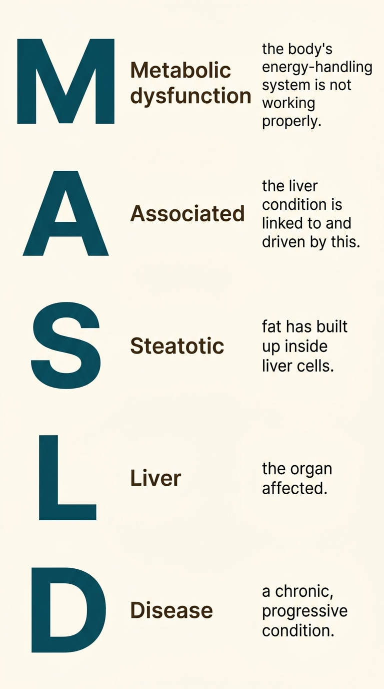

::: justify-text
**Hello everyone!**\
Welcome to my blog 🎉\
Today, I want to continue from where we left off last time, because before we can properly talk about fatty liver disease, we need to talk about something more fundamental: what we call it, and why the name spent decades quietly getting in the way.\

*The way we name a disease shapes how patients feel, how doctors think, and how whole communities decide whether to come forward or stay silent.*\

There is a scene I keep coming back to when I think about this. A middle-aged man, slim, a lifelong teetotaller, goes for a routine ultrasound somewhere across South Asia. The report comes back: fatty liver. His doctor, following the textbook, tells him this condition is linked to alcohol. The patient is confused, then offended. He has never touched alcohol in his life. He wonders if there has been a mistake. He does not return for follow-up. His family does not believe him. And the condition that needed attention continues, quietly, unmonitored.\

This story is not a hypothetical. Versions of it have played out countless times across the subcontinent, in clinics and hospital waiting rooms, in conversations that should have been about metabolism and diet and insulin levels but became instead about suspicion and shame. The name of the disease was doing the damage. And for four decades, nobody changed it.\

**Where the old name came from**\
The story begins in 1980, in a paper published in *Mayo Clinic Proceedings*, in which a physician named Jurgen Ludwig described a pattern he had noticed in patients: people who had never drunk significant amounts of alcohol, yet whose livers, when biopsied, looked exactly like those of people who had. The injury, the fat, the inflammation, the scarring — all of it matched what had historically been called alcoholic liver disease.\

Ludwig needed a term that captured this resemblance while distinguishing these patients from those whose damage came from drinking. He called it nonalcoholic fatty liver disease, or NAFLD. For its time, it was a reasonable clinical shorthand. The more severe, inflammatory form was called NASH, nonalcoholic steatohepatitis.\

These acronyms survived for over forty years. NAFLD became the standard term in textbooks, research papers, clinical guidelines, and patient leaflets. The problem is that reasonable clinical shorthand and accurate disease naming are not the same thing, and as the number of people affected grew into the hundreds of millions, the gap between them became harder to ignore.\

**The problem with defining a disease by what it is not**\
There are two ways a name can fail. It can mislead, and it can misdirect. NAFLD did both.\

The misleading part is obvious in retrospect. If your doctor tells you that you have a *nonalcoholic* condition, the word your brain registers first is alcohol. It sits in the sentence like an implication, however unintended. In South Asian communities, where alcohol is either religiously prohibited or socially stigmatised, this was not a minor inconvenience. It was a genuine barrier to care. Patients who had never drunk felt accused. Families were suspicious. The clinical conversation that needed to happen, about insulin resistance and visceral fat and dietary patterns, was crowded out by a word that pointed in entirely the wrong direction.\

The misdirection was subtler but perhaps more damaging at the systemic level. Naming a disease by what does not cause it tells you nothing about what does. A doctor seeing a patient labelled with NAFLD might focus their questions on drinking history. They might not think to ask about blood sugar, or abdominal girth, or family history of diabetes. The name was steering clinical attention away from the metabolic machinery that actually drives the disease.\

The 2023 Delphi consensus process found that 61% of respondents considered the term "nonalcoholic" to be stigmatising, and 66% felt the same about the word "fatty." These were majority views, not fringe complaints, from the very people who lived and worked with the disease every day.\

**The Delphi consensus**\
What followed was a significant piece of international collaboration. Between 2022 and 2023, more than three hundred specialists from around the world, including hepatologists, endocrinologists, patient advocates, and researchers, came together through a process known as a Delphi consensus. In this kind of exercise, experts independently assess a set of proposals across several rounds of voting until clear agreement emerges.\

The goal was to find a name that accurately reflected the disease's biology, reduced stigma, and worked across languages and cultures. After extensive debate, they arrived at one that was subsequently adopted by all major liver disease societies worldwide.\

That name is MASLD: Metabolic Dysfunction-Associated Steatotic Liver Disease.\

<figure style="width: 35%; max-width: 400px; margin: 2em auto; display: block; text-align: center;">
  
  <figcaption style="font-size: 0.85em; text-align: center; margin-top: 0.6em; color: #888; font-family: 'Source Sans 3', sans-serif;">
    A breakdown of what each word in MASLD stands for. 
    <em>Image created using Google Gemini</em>
  </figcaption>
</figure>\

**What the new name actually means**\
Each word is doing real work here, which is worth taking a moment to appreciate.\

*Metabolic dysfunction* names the actual driver of the disease. The liver does not accumulate fat in isolation. It does so because the body's metabolic system, the machinery that handles energy, sugar, and fat, is not functioning as it should. Insulin resistance sits at the centre of this, and it is something we will spend considerable time on in later posts. The new name announces from the outset that the liver is the site of injury, but metabolism is where the problem begins.\

*Steatotic* replaces the word fatty. It comes from the Greek *stear*, meaning fat, and it describes the same biological finding — fat accumulating inside liver cells — without the value judgement the everyday word carries. It is more precise and less editorialising. The severe inflammatory form, previously called NASH, is now MASH: Metabolic dysfunction-Associated Steatohepatitis.\

Beyond the name, the new diagnostic criteria also shifted the clinical framework in a meaningful way. Under the old system, NAFLD was a diagnosis of exclusion: rule out alcohol, rule out a few rare causes, and whatever remained was NAFLD, with no requirement to confirm the presence of metabolic dysfunction. The new criteria for MASLD require at least one of five cardiometabolic risk factors — excess weight, type 2 diabetes or prediabetes, elevated blood pressure, elevated blood fats, or abnormal waist measurement. The diagnosis now actively looks for the metabolic context rather than simply ruling out other explanations.\

**Why the rename matters here**\
The metabolic dysfunction at the centre of MASLD, particularly insulin resistance and visceral fat accumulation, is extraordinarily prevalent across South Asia. People in this region develop these metabolic problems at lower body weights and younger ages than populations of European descent. The shift from *nonalcoholic* to *metabolic* is therefore a shift toward the very territory where South Asian risk is concentrated. It makes this population visible in the disease framework in ways the old name never managed.\

There is also the simpler matter of removing a word from the clinical encounter that had no business being there. When words change, thinking changes. When thinking changes, medicine changes. And when medicine changes, it sometimes reaches people it never quite reached before.\

In the next post, we will ask what should be a straightforward question: how common is this disease, and what do the numbers actually look like for South Asia? The answer is not what most people expect.\

---

**Further reading**\
Ludwig J et al. Nonalcoholic steatohepatitis: Mayo Clinic experiences with a hitherto unnamed disease. *Mayo Clinic Proceedings*, 1980.\
Rinella ME et al. A multisociety Delphi consensus statement on new fatty liver disease nomenclature. *Journal of Hepatology*, 2023.\

:::

<!-- Giscus Comment Box -->

  

