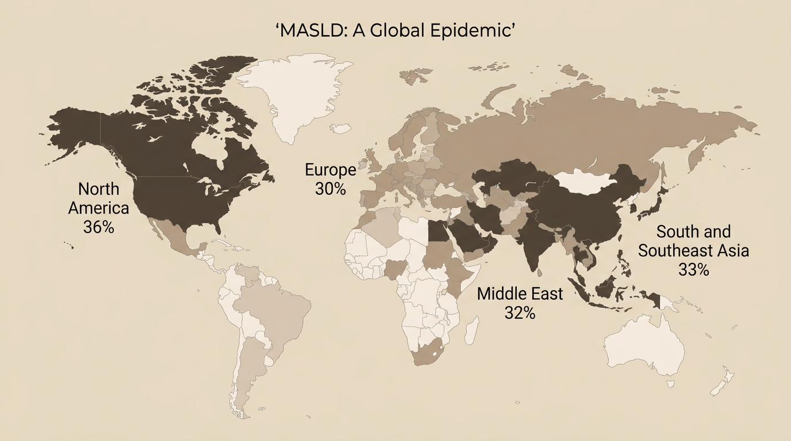

::: justify-text
**Hello everyone!**\
Welcome to my blog 🎉\
Last time, we talked about why fatty liver disease changed its name. Today I want to take a step back and ask what should be a simpler question: how many people actually have this condition?\

*The answer, once you sit with it, is genuinely difficult to look away from.*\

Recent meta-analyses, the largest of which have pooled data from tens of millions of individuals, consistently place the global prevalence of MASLD somewhere between 33 and 38 percent of adults. That is roughly one in three people on the planet. The variation between these estimates reflects differences in diagnostic methods and populations studied, but the scale is consistent across all of them: this is one of the most common chronic conditions in the world, and it is getting more common.\

To put that in context: the MASLD burden exceeds the global prevalence of type 2 diabetes, which is itself considered one of the defining health crises of our era. Over the past two decades, prevalence has risen by roughly 50 percent. Current projections estimate that by 2040, more than half of adults in high-risk groups may be affected. Unlike most infectious diseases, which rise and fall with outbreaks and interventions, MASLD moves in one direction, driven by the global shift toward sedentary work, calorie-dense diets, and rising rates of metabolic dysfunction.\

MASLD is now the most common chronic liver disease in the world, having overtaken viral hepatitis in many countries. It is also the fastest-growing cause of liver transplant waitlisting. These are not peripheral statistics. They describe the trajectory of a condition that is quietly becoming one of the most significant public health challenges of the coming decades.\

**The South Asian picture**\
Studies from Asia place regional MASLD prevalence broadly in the range of 28 to 33 percent, closely mirroring the global average. But averages can flatten important variation, and the story in South Asia has specific features worth understanding.\

Urban populations across the subcontinent consistently show higher rates than rural ones. This reflects the rapid pace of lifestyle change that has accompanied economic development: sedentary office work, longer commutes, more processed food, irregular meal timing, and a reduction in the incidental physical activity that was once built into daily life. The liver, it turns out, is particularly sensitive to exactly this kind of metabolic shift.\

There is also a biological dimension that makes South Asian populations especially vulnerable in ways the regional average does not fully capture. People of South Asian descent tend to develop insulin resistance and accumulate fat around their internal organs at lower body weights and younger ages than people of European descent. This matters for how we interpret prevalence data, because much of that data was collected using risk thresholds designed for Western populations. The true burden in South Asia may be higher than the headline figures suggest, because the people most at risk are not always captured by screening criteria that were never designed with their biology in mind. We will spend a great deal of time on this when we get to the lean MASLD section of this series, where the most interesting and underappreciated science lives.\

**Why the true numbers are almost certainly higher**\
Every prevalence estimate in the MASLD literature is probably an undercount, and it is worth being explicit about why.\

The first reason is that MASLD is, for most of its course, completely asymptomatic. People feel fine. There is no pain, no obvious sign, no reason to investigate. The cases that get counted in prevalence surveys are mostly the ones found incidentally, picked up on an ultrasound ordered for something unrelated, or noticed during a metabolic workup for diabetes. The people who never see a doctor, who have no reason to get a scan, are not in the data.\

The second reason is a limitation of the diagnostic tool most commonly used in population studies. Ultrasound can detect moderate to severe fat accumulation in the liver reliably, but it misses mild steatosis, and its accuracy depends heavily on the skill and experience of the operator. Early and mild cases are routinely undercounted.\

The third reason is access. A large proportion of the population across South Asia, particularly in rural and semi-urban areas, does not have reliable access to ultrasound or liver function testing. These communities are systematically absent from most research, which means the burden in underserved populations is almost entirely unmeasured.\

The fourth reason is clinical framing. If a patient presents without obvious obesity and without a history of alcohol use, fatty liver is rarely on the differential diagnosis. Many clinicians still work from a mental model that links MASLD primarily to overweight and drinking. Patients who do not fit that profile are simply not investigated, and there are far more of them than most people realise.\

<figure style="width: 90%; max-width: 900px; margin: 2em auto; display: block; text-align: center;">
  
  <figcaption style="font-size: 0.85em; text-align: center; margin-top: 0.6em; color: #888; font-family: 'Source Sans 3', sans-serif;">
    Estimated MASLD prevalence across global regions. South and Southeast Asia carry a burden comparable to the global average, with urban populations showing some of the highest documented rates. 
    <em>Image created using Google Gemini</em>
  </figcaption>
</figure>\

**The number that matters most**\
Of all the statistics in the MASLD literature, the one I find most significant is not the overall prevalence figure. It is this: between 10 and 20 percent of all MASLD cases globally occur in people with a normal or below-normal BMI. In South Asian populations, some biopsy-based studies suggest this proportion is even higher.\

These are people who would not be flagged as at risk by current screening guidelines. Their weight is normal. Their liver enzymes are often normal too. Their doctors are not looking for fatty liver disease in them, because the disease framework says they should not have it. They do have it. And because they are not being screened, they are almost always diagnosed later, at more advanced stages, when the disease is harder to manage and the options are more limited.\

This group, lean individuals with MASLD, is where the most pressing research questions in the field live right now, and it is where this series is headed. Understanding why a person with a normal weight can develop significant liver disease requires getting into the biology of how fat accumulates in the liver, how insulin resistance develops independently of obesity, and why South Asian populations appear to be disproportionately affected. That is what the next several posts are about.\

The absence of a symptom is not the absence of a problem. And the absence of excess weight, it turns out, is not the absence of risk either.\

---

**Further reading**\
Ho GJK et al. High Global Prevalence of Steatotic Liver Disease and Associated Subtypes: A Meta-analysis. *Clinical Gastroenterology and Hepatology*, 2025.\
Rinella ME et al. A multisociety Delphi consensus statement on new fatty liver disease nomenclature. *Journal of Hepatology*, 2023.\

:::

<!-- Giscus Comment Box -->

  

