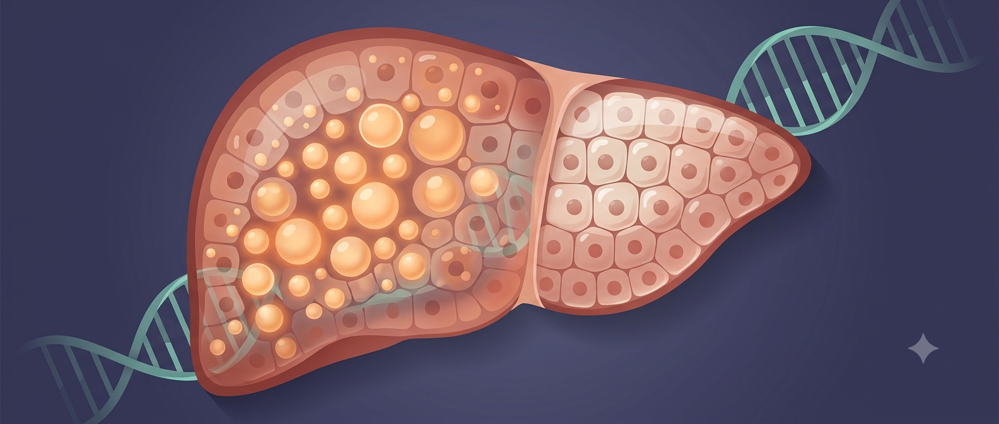

**Hello everyone!**\
Welcome to my blog 🎉\
Today, I will discuss a landmark Nature paper that used the genomes of 173,000 people from Pakistan to reveal what happens when human genes are naturally switched off — and what that tells us about liver disease, obesity, and the future of medicine.

*Sometimes, the answers to humanity's biggest medical questions have been living quietly in a particular community for generations. We just hadn't thought to ask.*

There is a moment in science when the scale of a finding stops you. Last week, a paper published in *Nature* gave me one of those moments.

Researchers analysed the genomes of 173,303 people from across Pakistan and found something remarkable: more than 34,000 of them are what scientists call "human knockouts." They are carrying at least one gene that has been completely switched off, not through any intervention, not in a laboratory, but naturally, as a consequence of their genetics. Across the entire cohort, 6,476 genes, roughly one third of all the protein-coding genes in the human body, were found in a completely inactivated state in at least one person.

This is the largest natural repository of human knockouts ever assembled. And for those of us working on fatty liver disease and metabolic conditions, several of its findings are remarkable.

**What Is a "Human Knockout" – and Why Does It Matter?**

In biomedical research, one of the most powerful tools available to scientists is the ability to "knock out" a gene in an animal: to disable it completely and then observe what happens. Mouse models built on this principle have driven decades of drug development. If you want to know what a particular gene does, you remove it and watch.

The problem is that mice are not people. Genes that are essential to a mouse's survival are sometimes entirely dispensable in humans, and vice versa. This mismatch, elegant in theory and expensive in practice, is one of the central reasons why drugs that work beautifully in animal studies so often fail in clinical trials.

What the Pakistan Genome Resource (PGR) offers is something different: naturally occurring human knowouts. People who were born, lived, and raised without a functional copy of a particular gene. "These human variants are nature's experiments," says Christopher Koch, a geneticist at Novartis Biomedical Research and co-lead author of the study. "They allow us to understand what happens when a gene's function is reduced or completely absent in humans."

This is an extraordinary resource, and Pakistan's distinctive population structure is precisely why it exists.

**Why Pakistan?**

Since the 1960s, scientists have understood that populations with high rates of consanguineous marriage, that is, marriages between close relatives, are uniquely valuable for genetic research. When two people who are closely related have children, those children are more likely to inherit the same rare genetic variants from both parents. If both copies of a gene are disrupted in this way, the gene is silenced entirely.

In Pakistan, marriages between first cousins have been culturally common for centuries. Around a third of participants in the Pakistan Genome Resource come from first-cousin marriages. As a result, approximately one in five people in the PGR is a human knockout, compared with roughly one in fourteen in European genomic databases. The resource is, in the words of its lead researcher Danish Saleheen of Columbia University, "3.5 times more efficient at identifying human genetic knockouts than European ancestry databases."

That matters because South Asians, representing around 25% of the world's population, account for only 2% of global genomic data. Decades of genetics research have been built on datasets that are overwhelmingly European in ancestry. The Pakistan Genome Resource is a significant step toward correcting that.

**What the Study Found About Fatty Liver Disease**

For those working on metabolic dysfunction-associated steatotic liver disease (MASLD), formerly known as non-alcoholic fatty liver disease or NAFLD, one of the most striking findings concerns a gene called *CIDEB*.

*CIDEB* encodes a protein involved in fat droplet formation and lipid metabolism in the liver. Earlier work had suggested it might be a promising drug target. The Pakistan study has now provided compelling human evidence that it is exactly that.

Fourteen individuals in the cohort carried two non-functioning copies of the *CIDEB* gene, meaning they had no working CIDEB protein at all. When the researchers examined their health, those individuals showed no obvious liver problems. Genetic analyses across the broader dataset linked loss of *CIDEB* to lower liver enzyme levels and lower rates of fatty liver disease. People who had naturally silenced *CIDEB* appeared to be protected.

"The findings support efforts to develop therapies that inhibit the gene," Koch says. For drug developers targeting MASLD, this is significant: it is exactly the kind of human validation that mouse studies cannot provide with confidence.

{fig-align="center" width="100%"}

<em>Image created using Google Gemini</em>

**The Obesity Connection**

The study also confirmed and extended findings on the genetics of obesity, findings with direct relevance to metabolic disease in South Asian populations.

Individuals carrying loss-of-function mutations in the *POMC*, *MC4R*, and *MRAP2* genes, all components of a key appetite-regulating signalling pathway in the brain, showed significantly elevated body mass index. This reinforces what researchers have long suspected: that disruptions in this central energy balance pathway are a meaningful contributor to severe obesity, and that pharmacological restoration of signalling in this pathway might offer a route to treatment.

The study also found that loss of *ADCY3*, a gene involved in cAMP signalling, was linked to obesity, adding to a growing body of evidence implicating this pathway in weight regulation.

None of this is simple, of course. Most obesity is not the result of a single knocked-out gene. But understanding these extreme cases, where a gene's absence has a clear and measurable effect on body weight, provides a map of the biological machinery that governs energy balance and points toward where interventions might work.

**When Human Data Overturns the Mouse**

Some of the most important findings in the paper are not about what the gene knockouts cause, but about what they do not cause.

The *RXFP1* gene, which encodes a receptor involved in relaxin signalling, had been an active target in pharmaceutical research on heart failure and tissue scarring, partly on the basis of animal data suggesting it played a central role in cardiovascular and reproductive function. But when the Pakistan study identified 26 people who lacked any working copy of *RXFP1*, they found little evidence of consistent cardiovascular, kidney, or reproductive problems. Several clinical trials targeting this receptor have struggled without clear explanation. The human knockout data may finally provide one.

Similarly, *PRDM9*, a gene considered essential for fertility in mice since male mice without it are sterile, was found to be dispensable for human reproduction. Four people in the cohort carrying homozygous loss-of-function variants in *PRDM9* had children.

These discrepancies matter enormously. They represent billions of dollars in failed drug development that might have been avoided with earlier access to human genetic evidence. "Our database could prevent companies from spending millions of dollars on drug candidates doomed to fail," Saleheen says, "or give them confidence to move ahead."

**A Community in the Data**

There is something worth sitting with in the fact that this study, one which will almost certainly shape future medicines taken by people around the world, is built on the genetics of a South Asian community that global genomics has, until very recently, largely overlooked.

The genes that are helping researchers understand liver disease, obesity, Parkinson's, and heart failure exist in Pakistani bodies, passed down through Pakistani families, reflecting a cultural practice of consanguineous marriage that spans centuries. The scientific value of this resource is inseparable from the people who make it up.

That is worth naming, not only to give credit where it is due, but because it speaks to a broader point about how science is done and whose lives are centred when we decide what to study. South Asian populations carry distinctive genetic ancestry, distinctive disease risks, and, as this paper demonstrates, distinctive biological insights that simply cannot be found at scale anywhere else. The argument for including them in genomic research is not just ethical. It is scientific.

For those of us who work on MASLD, who study metabolic disease in populations where it is rising fast and often goes undetected, papers like this one are a reminder of where some of the most important answers may be found: not always in mouse cages, and not always in the datasets that were built first.

Sometimes, the answers have been living in people's genes all along.

*Koch C. et al. "Analysis of 173,303 exomes and genomes in the Pakistan Genome Resource." Nature (2026). DOI: 10.1038/s41586-026-10667-5*
